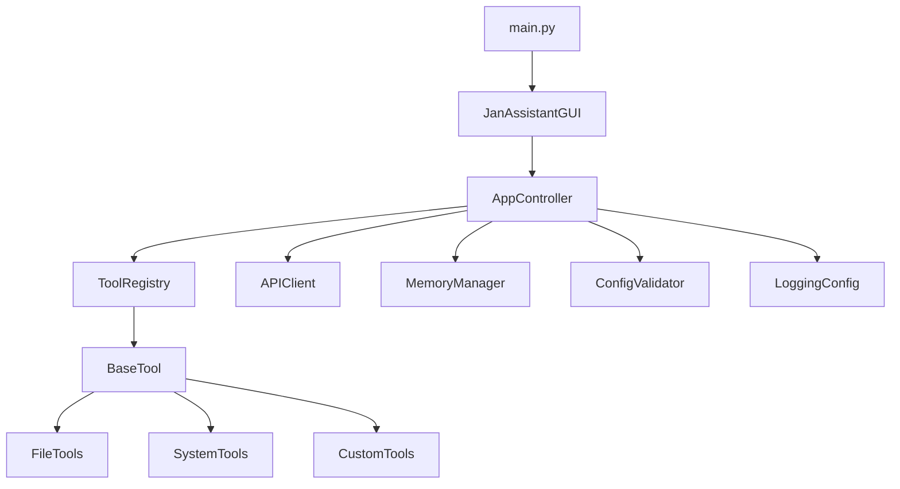

# Developer Guide - Jan Assistant Pro

## Table of Contents

1. [Overview](#overview)
2. [Architecture](#architecture)
3. [Getting Started](#getting-started)
4. [Tool Development](#tool-development)
5. [Testing](#testing)
6. [Configuration](#configuration)
7. [Logging](#logging)
8. [Error Handling](#error-handling)
9. [Best Practices](#best-practices)
10. [Migration Guide](#migration-guide)

## Overview

- Jan Assistant Pro is built with enterprise-grade architecture featuring:
- **Dynamic Tool Registry**: Hot-loadable tool system
- **Plugin Loader**: Load third-party tools from the plugins directory
- **Event Manager**: Observe configuration and application events
- **MVC Architecture**: Clean separation of concerns
- **Structured Error Handling**: Rich error context and debugging
- **Advanced Logging**: Production-ready logging infrastructure
- **Schema Validation**: Type-safe configuration
- **Comprehensive Testing**: Full test coverage
- **Progress Bar** and **Connection Indicator** for clear status
- **History Navigation** with **Autocomplete** in the GUI

## Architecture

### MVC Pattern

```
┌─────────────────┐    ┌─────────────────┐    ┌─────────────────┐
│      View       │    │   Controller    │    │      Model      │
│                 │    │                 │    │                 │
│ main_window.py  │◄──►│app_controller.py│◄──►│  config.py      │
│                 │    │                 │    │  api_client.py  │
│ - UI Rendering  │    │ - Business      │    │  memory.py      │
│ - User Input    │    │   Logic         │    │  tool_registry  │
│ - Display       │    │ - Coordination  │    │  tools/         │
└─────────────────┘    └─────────────────┘    └─────────────────┘
```

### Component Relationships



## Getting Started

### Development Setup

1. **Clone and setup environment**:
   ```bash
   git clone https://github.com/CreativeNewEra/jan-assistant-pro.git
   cd jan-assistant-pro
   poetry install --with dev
   pre-commit install
   ```
   This installs git hooks so formatting and type checks run automatically
   before each commit.

2. **Run tests to verify setup**:
   ```bash
   poetry run pytest tests/ -v
   ```

3. **Start development server**:
   ```bash
   python main.py
   ```

### Project Structure Deep Dive

```
src/
├── core/                           # Core application logic
│   ├── app_controller.py          # Main application controller
│   ├── config.py                  # Configuration management
│   ├── enhanced_config.py        # Environment-aware config
│   ├── config_validator.py        # Schema-based validation
│   ├── exceptions.py              # Custom exception hierarchy
│   ├── logging_config.py          # Advanced logging setup
│   ├── api_client.py             # API communication
│   └── memory.py                 # Persistent memory system
├── gui/
│   └── main_window.py            # GUI interface (View layer)
└── tools/                        # Tool system
    ├── base_tool.py              # Abstract base tool class
    ├── tool_registry.py          # Dynamic tool registry
    ├── file_tools.py             # File operation tools
    ├── system_tools.py           # System command tools
    └── secure_command_executor.py # Sandboxed command runner
```

## Tool Development

### Creating a New Tool

1. **Inherit from BaseTool**:

```python
from tools.base_tool import BaseTool, ToolInfo, ToolParameter
from typing import Dict, Any

class WeatherTool(BaseTool):
    """Tool for getting weather information"""
    
    def get_tool_info(self) -> ToolInfo:
        return ToolInfo(
            name="weather",
            description="Get current weather for a city",
            category="utilities",
            parameters=[
                ToolParameter(
                    name="city",
                    description="City name",
                    param_type=str,
                    required=True
                ),
                ToolParameter(
                    name="units",
                    description="Temperature units (celsius/fahrenheit)",
                    param_type=str,
                    required=False,
                    default="celsius"
                )
            ],
            examples=[
                "Get weather for Tokyo",
                "Check weather in London with fahrenheit units"
            ]
        )
    
    def execute(self, **kwargs) -> Dict[str, Any]:
        """Execute the weather tool"""
        try:
            city = kwargs['city']
            units = kwargs.get('units', 'celsius')
            
            # Your weather API logic here
            weather_data = self._fetch_weather(city, units)
            
            return self._create_success_response(weather_data, {
                'city': city,
                'units': units,
                'source': 'weather_api'
            })
            
        except Exception as e:
            return self._create_error_response(f"Weather fetch failed: {str(e)}")
    
    def _fetch_weather(self, city: str, units: str) -> Dict[str, Any]:
        """Fetch weather data from API"""
        # Implementation here
        pass
```

2. **Register your tool**:

```python
from tools.tool_registry import register_tool

# Register the tool globally
register_tool(WeatherTool)
```

3. **Test your tool**:

```python
import unittest
from tools.tool_registry import ToolRegistry

class TestWeatherTool(unittest.TestCase):
    def setUp(self):
        self.registry = ToolRegistry()
        self.registry.register_tool(WeatherTool)
    
    def test_weather_tool_execution(self):
        result = self.registry.execute_tool("weather", city="Tokyo")
        self.assertTrue(result['success'])
        self.assertIn('temperature', result['result'])
```

### Tool Features

#### Automatic Validation
Parameters are automatically validated based on `ToolParameter` definitions:

```python
ToolParameter(
    name="temperature",
    description="Temperature threshold",
    param_type=float,
    required=True,
    validator_func=lambda x: (0 <= x <= 100, "Temperature must be 0-100")
)
```

#### Built-in Help Generation
Tools automatically generate help documentation:

```python
help_text = registry.generate_help("weather")
print(help_text)
# Outputs formatted help with parameters, types, and examples
```

#### Error Handling
Use built-in error response methods:

```python
# Success response
return self._create_success_response(result_data, metadata)

# Error response
return self._create_error_response("Something went wrong", metadata)
```

#### Logging Integration
Tools inherit logging capabilities:

```python
class MyTool(BaseTool):
    def execute(self, **kwargs):
        self.logger.info("Tool execution started", user_id=123)
        # Tool logic
        self.logger.debug("Processing completed", items_processed=42)
```

## Testing

### Test Structure

```
tests/
├── test_enhanced_features.py      # Integration tests for new features
├── test_api_client.py            # API client tests
├── test_file_tools.py            # File operation tests
├── test_memory_manager.py        # Memory system tests
├── test_system_tools.py          # System tool tests
└── conftest.py                   # Test configuration and fixtures
```

### Writing Tests

#### Unit Tests
```python
import unittest
from unittest.mock import Mock, patch
from tools.my_tool import MyTool

class TestMyTool(unittest.TestCase):
    def setUp(self):
        self.tool = MyTool({'setting': 'value'})
    
    def test_tool_execution(self):
        result = self.tool.execute(param="test")
        self.assertTrue(result['success'])
        self.assertEqual(result['result'], 'expected_output')
    
    @patch('tools.my_tool.external_api_call')
    def test_with_external_dependency(self, mock_api):
        mock_api.return_value = {'data': 'test'}
        result = self.tool.execute(param="test")
        self.assertTrue(result['success'])
        mock_api.assert_called_once()
```

#### Integration Tests
```python
class TestToolIntegration(unittest.TestCase):
    def setUp(self):
        self.registry = ToolRegistry()
        self.registry.register_tool(MyTool)
    
    def test_tool_registry_integration(self):
        # Test tool registration
        tools = self.registry.list_tools()
        self.assertIn('my_tool', tools)
        
        # Test tool execution through registry
        result = self.registry.execute_tool('my_tool', param="test")
        self.assertTrue(result['success'])
```

### Running Tests

```bash
# Run all tests
poetry run pytest tests/ -v

# Run with coverage
poetry run pytest tests/ --cov=src/ --cov-report=html

# Run specific test file
poetry run pytest tests/test_enhanced_features.py -v

# Run tests matching pattern
poetry run pytest tests/ -k "test_weather" -v
```

## Configuration

### Schema-Based Validation

Configuration is validated and loaded through `UnifiedConfig`, which
combines schema validation and environment variable support:

```python
from core.unified_config import UnifiedConfig
from core.config_validator import ValidationRule

# Create custom validation rules
cfg = UnifiedConfig('config.json')
cfg.validator.schema.add_rule('my_tool.api_key', ValidationRule(
    field_type=str,
    required=True,
    description="API key for my tool"
))

# Validate configuration
config = cfg.config_data
```

### Configuration Structure

```json
{
  "api": {
    "base_url": "http://127.0.0.1:1337/v1",
    "api_key": "your-key",
    "model": "model-name",
    "timeout": 30
  },
  "memory": {
    "file": "data/memory.json",
    "max_entries": 1000,
    "auto_save": true
  },
  "ui": {
    "theme": "dark",
    "window_size": "800x600",
    "font_family": "Consolas",
    "font_size": 10
  },
  "security": {
    "allowed_commands": [
      "ls", "pwd", "date", "whoami", "echo",
      "cat", "head", "tail", "grep"
    ],
    "restricted_paths": ["/etc", "/sys"],
    "blocked_commands": ["rm", "shutdown"],
    "command_timeout": 30,
    "max_command_output": "20KB",
    "sandbox_dir": "sandbox",
    "max_file_size": "10MB"
  },
  "logging": {
    "level": "INFO",
    "enable_file": true,
    "enable_json": false
  }
}
```

### Cache Management

Jan Assistant Pro uses several caches to speed up operation:

- **API cache** – stores recent API responses to avoid duplicate requests.
- **Disk cache** – keeps temporary files so large downloads aren't repeated.
- **Config cache** – holds parsed configuration for quick reloads.

Configure cache sizes and expiration in `config/config.json`:

```json
"cache": {
  "api": {"size": 64, "ttl": 300},
  "disk": {"dir": "data/cache", "ttl": 86400},
  "config": {"ttl": 60}
}
```

Set any value to `0` to disable caching. TTL values are in seconds.

Clear caches by deleting `data/cache/*` and restarting the app.

### Database Migrations

The SQLite memory database schema is versioned using a simple migration
system located in `src/migrations/`. Each migration file exposes
`upgrade(conn)` and `downgrade(conn)` functions. The current schema
version is stored in the `schema_version` table.

Migrations run automatically when `EnhancedMemoryManager` initializes, but
you can apply or roll back migrations manually:

```bash
python -m src.core.migration_manager data/memory.sqlite        # apply
python -m src.core.migration_manager data/memory.sqlite --rollback 1
```

## Logging

### Setup Logging

```python
from core.logging_config import setup_logging, get_logger

# Setup application logging
setup_logging(
    log_level="INFO",
    log_dir="logs",
    enable_console=True,
    enable_file=True,
    enable_json=False
)

# Get logger for your module
logger = get_logger(__name__)
```

### Using Logger Mixin

```python
from core.logging_config import LoggerMixin

class MyClass(LoggerMixin):
    def process_data(self):
        self.log_info("Processing started", record_count=100)
        
        try:
            # Processing logic
            self.log_debug("Processing step completed", step="validation")
        except Exception as e:
            self.log_exception("Processing failed", error=str(e))
```

### Performance Logging

```python
from core.logging_config import log_performance

@log_performance
def expensive_operation():
    # This will automatically log execution time
    pass
```

### Metrics Collection

Jan Assistant Pro exposes Prometheus metrics for monitoring. Start the metrics
server and access `/metrics` to collect runtime statistics.

### Health Checks

Use `HealthChecker` to verify core dependencies like the API, memory usage and
disk space.

```python
from core import HealthChecker, APIClient

client = APIClient(...)
checker = HealthChecker(client)
status = await checker.check_all()
```

### Structured Logging

```python
logger.info("User action", extra={
    'extra_fields': {
        'user_id': 123,
        'action': 'file_read',
        'file_path': '/path/to/file',
        'success': True
    }
})
```

You can also create a request context to automatically attach a correlation ID
and timing information to each log message:

```python
from core import RequestContext

ctx = RequestContext(logger)
ctx.log("info", "Processing request")
```

## Error Handling

### Exception Hierarchy

```python
from core.exceptions import (
    JanAssistantError,      # Base exception
    ConfigurationError,     # Config-related errors
    APIError,              # API communication errors
    ToolError,             # Tool execution errors
    ValidationError,       # Input validation errors
    SecurityError,         # Security violations
    FileOperationError     # File operation errors
)
```

### Using Structured Exceptions

```python
from core.exceptions import ToolError, handle_exception

def my_tool_function():
    try:
        # Tool logic
        pass
    except SomeError as e:
        raise ToolError(
            "Tool execution failed",
            tool_name="my_tool",
            context={'input_param': value, 'step': 'validation'}
        ) from e

# Handle exceptions
try:
    my_tool_function()
except Exception as e:
    error_response = handle_exception(e)
    # error_response is a standardized dictionary
```

### Creating Custom Exceptions

```python
from core.exceptions import JanAssistantError

class MyToolError(JanAssistantError):
    """Custom exception for my tool"""
    
    def __init__(self, message: str, operation: str = None, **kwargs):
        super().__init__(message, **kwargs)
        self.operation = operation
        if operation:
            self.context['operation'] = operation
```

## Best Practices

### Tool Development

1. **Single Responsibility**: Each tool should have one clear purpose
2. **Comprehensive Validation**: Validate all inputs thoroughly
3. **Rich Error Messages**: Provide helpful error information
4. **Logging**: Log important operations and errors
5. **Testing**: Write comprehensive tests for all functionality

### Code Quality

1. **Type Hints**: Use type hints throughout your code
2. **Docstrings**: Document all classes and functions
3. **Error Handling**: Use structured exceptions
4. **Configuration**: Make functionality configurable
5. **Testing**: Maintain high test coverage

### Performance

1. **Lazy Loading**: Load resources only when needed
2. **Caching**: Cache expensive operations
3. **Async Operations**: Use threading for I/O operations
4. **Memory Management**: Clean up resources properly

### Thread Safety Helpers

Use the `thread_safe` context manager from `src.core.utils` to simplify locking:

```python
from src.core.utils import thread_safe

with thread_safe(my_lock):
    # critical section
    perform_work()
```

`thread_safe` acquires the given lock and releases it even if an exception is
raised within the block.

### Security

1. **Input Validation**: Validate all user inputs
2. **Path Sanitization**: Prevent path traversal attacks
3. **Command Filtering**: Restrict allowed system commands
4. **Audit Logging**: Log security-relevant operations
5. **Sandboxed Command Execution**: Run commands in isolated directories with resource limits

## Migration Guide

### From Legacy String-Based Tools

**Before (Legacy)**:
```python
# In main_window.py
elif "TOOL_WEATHER:" in response:
    city = response.split("TOOL_WEATHER:")[1].strip()
    weather_data = get_weather(city)
    return f"Weather in {city}: {weather_data}"
```

**After (New System)**:
```python
# Create tool class
class WeatherTool(BaseTool):
    def get_tool_info(self) -> ToolInfo:
        return ToolInfo(
            name="weather",
            description="Get weather information",
            category="utilities",
            parameters=[
                ToolParameter("city", "City name", str, required=True)
            ]
        )
    
    def execute(self, **kwargs) -> Dict[str, Any]:
        city = kwargs['city']
        weather_data = get_weather(city)
        return self._create_success_response(weather_data)

# Register tool
register_tool(WeatherTool)
```

### Benefits of Migration

- ✅ Automatic parameter validation
- ✅ Built-in error handling and logging
- ✅ Auto-generated help documentation
- ✅ Type safety and IDE support
- ✅ Comprehensive testing capabilities
- ✅ No manual string parsing

### Migration Steps

1. **Identify existing tools** in the codebase
2. **Create BaseTool subclasses** for each tool
3. **Move tool logic** to the `execute` method
4. **Define tool metadata** in `get_tool_info`
5. **Register tools** with the registry
6. **Remove legacy string parsing** code
7. **Update tests** to use the new system

## Troubleshooting

### Common Issues

**Tool not found**:
- Ensure tool is properly registered
- Check tool name matches exactly
- Verify tool class inherits from BaseTool

**Parameter validation fails**:
- Check parameter types match ToolParameter definitions
- Ensure required parameters are provided
- Verify custom validator functions work correctly

**Import errors**:
- Check Python path includes src directory
- Ensure all dependencies are installed
- Verify module structure is correct

**Configuration errors**:
- Use ConfigValidator to check config file
- Check JSON syntax is valid
- Ensure all required fields are present

### Debug Mode

Enable debug logging for detailed information:

```python
import logging
logging.basicConfig(level=logging.DEBUG)

# Or use the logging config
setup_logging(log_level="DEBUG", enable_console=True)
```

## Additional Resources

- [REFACTORING_SUMMARY.md](REFACTORING_SUMMARY.md) - Architecture changes overview
- [HIGH_IMPACT_IMPROVEMENTS_SUMMARY.md](HIGH_IMPACT_IMPROVEMENTS_SUMMARY.md) - Detailed improvement guide
- [API Documentation](api_docs/) - Auto-generated API documentation
  (run `make html` in the `docs/` directory to build)
- [Examples](../examples/) - Example implementations and usage patterns

For questions or support, please open an issue on GitHub or join our community discussions.
